# Cuberact Library v1.1.0

A growing collection of GDExtension components for Godot 4.5+. Currently includes:

- **CRope2D** — 2D rope physics simulation with modular architecture

Check the installed version at runtime: `CuberactLib.get_version()`

## Requirements

- **Godot 4.5+** (tested with 4.6)
- Pre-built native library in `addons/cuberact-library/` (all platforms included)

## Supported Platforms

| Platform       | Architecture     |
|----------------|------------------|
| macOS          | universal        |
| Windows        | x86_64, arm64    |
| Linux          | x86_64, arm64    |
| Web            | wasm32           |

## Installation

### Option A — Godot Asset Library

Install directly from the Godot editor's AssetLib tab. This adds both the library and example scenes to your project.

### Option B — GitHub Release (library only)

1. Download the latest ZIP from [Releases](https://github.com/cuberact/godot-cuberact-library/releases/latest)
2. Extract `cuberact-library/` into your project's `addons/` folder:

```
your-project/
├── addons/
│   └── cuberact-library/
│       ├── cuberact-library.gdextension
│       ├── LICENSE.md
│       ├── macos/
│       ├── windows/
│       ├── linux/
│       └── web/
└── project.godot
```

3. Reopen your project in Godot — all Cuberact classes will be available immediately

### Option C — Clone the full repository

Clone to get the complete project with examples, documentation, and a runnable Godot project:

```
git clone https://github.com/cuberact/godot-cuberact-library.git
```

Open `project.godot` in Godot 4.5+ and run the project — the launcher lets you pick any example scene.

---

## CRope2D

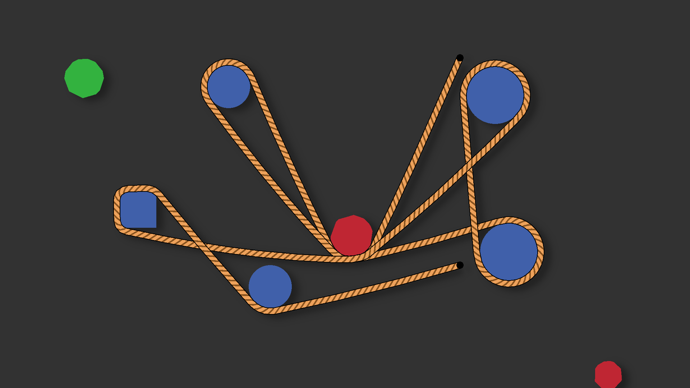

2D rope physics simulation built on Verlet integration. Supports collisions, anchoring, and a modular system for forces, rendering, line processing, and breaking.

For full API reference, see [CROPE2D.md](CROPE2D.md).

### Examples

Example scenes in `cuberact-library-examples/CRope2D/`, each demonstrating specific features:

| # | | Scene | Description |
|---|---|-------|-------------|
| 01 | 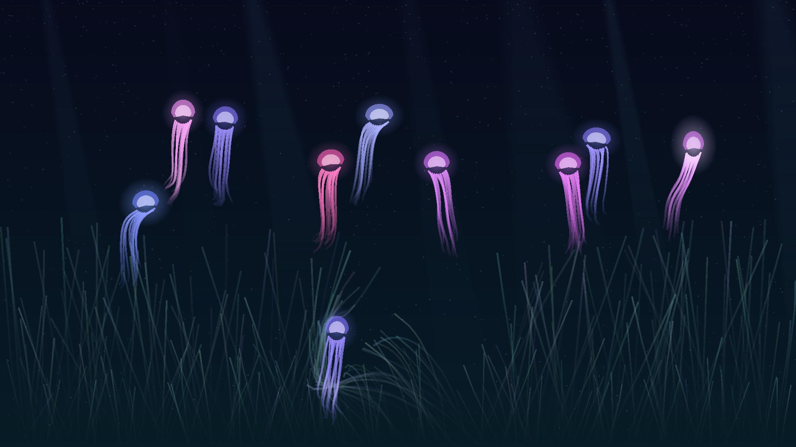 | **Jellyfish** | The opener: bioluminescent jellyfish pulsing above a swaying seagrass meadow |
| 02 | 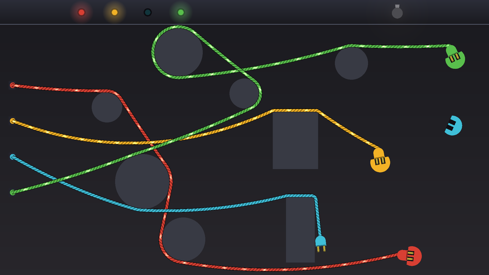 | **Plug the Wires** | A mini-game — plug cables into matching sockets and watch the current flow |
| 03 | 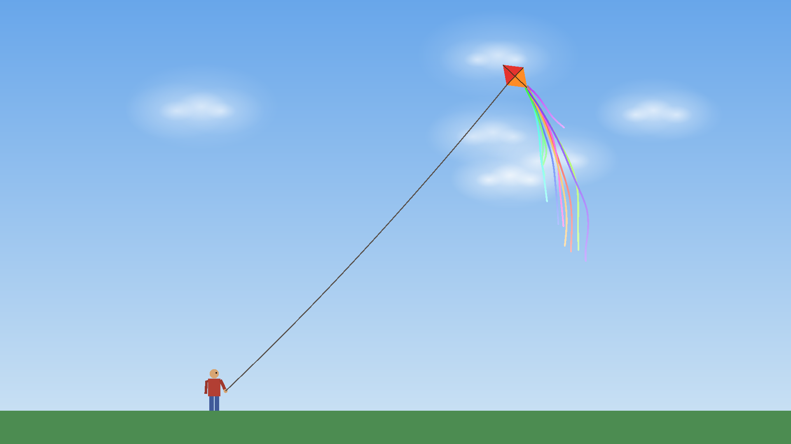 | **Kite** | A little guy flying a kite — walk, jump, winch the line, ten fluttering tails |
| 04 | 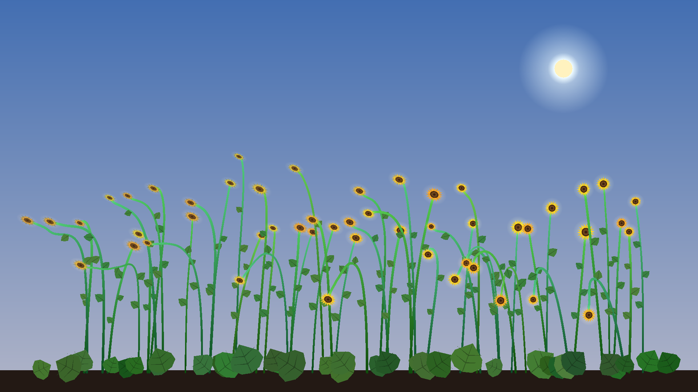 | **Growing Sunflowers** | Sunflowers grown point by point at runtime; the stems bear the heads, which turn to face a draggable sun |
| 05 | 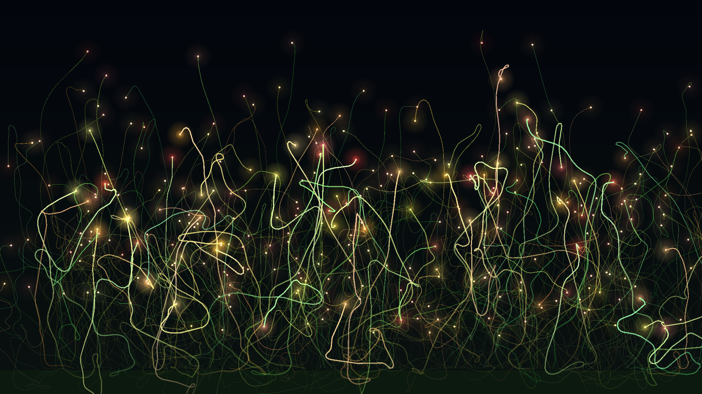 | **Firefly Meadow** | Blinking fireflies tethered to grass roots by barely visible threads |
| 06 | 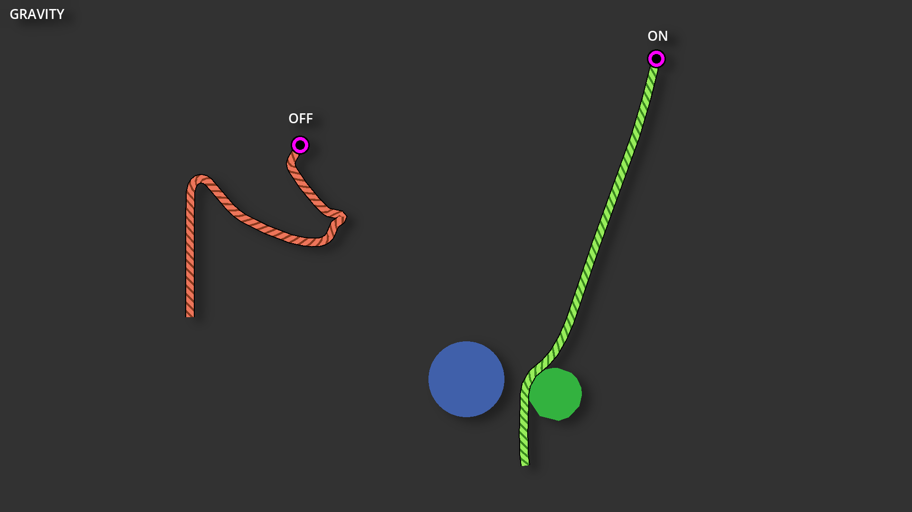 | **Gravity Force Module** | CRopeGravityForceMod — rope with and without gravity |
| 07 | 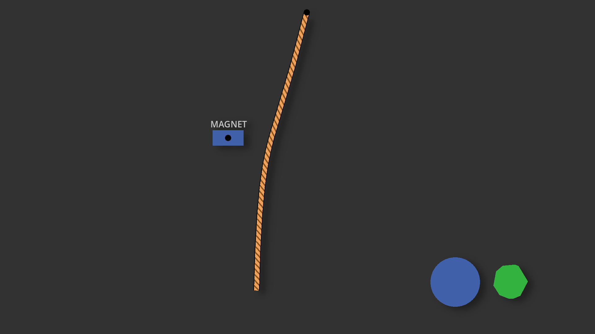 | **Magnet Force Module** | CRopeMagnetForceMod — draggable magnet attracting the rope |
| 08 | 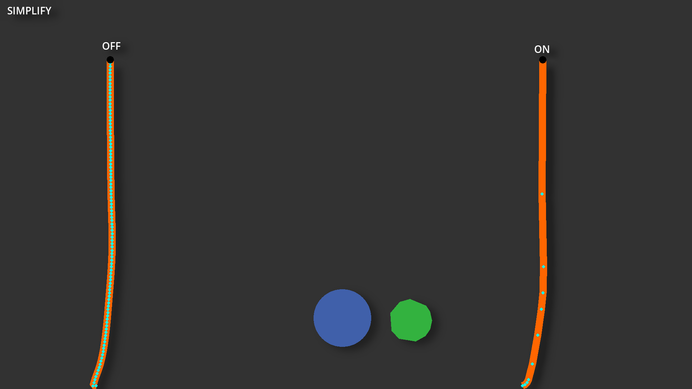 | **Simplify Line Module** | CRopeSimplifyLineMod — reducing rendered point count |
| 09 | 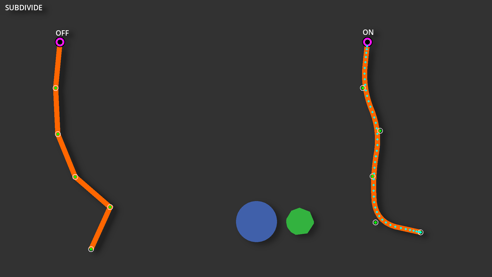 | **Subdivide Line Module** | CRopeSubdivideLineMod — adding detail to low-segment ropes |
| 10 | 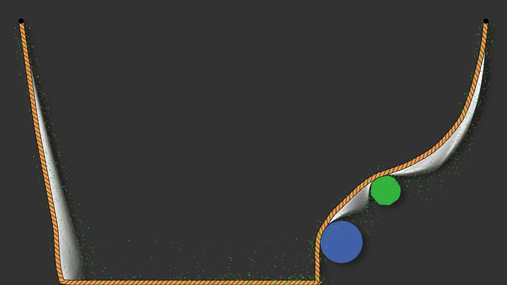 | **Custom Render Modules** | Trail afterimage and GPU particle emission along the rope |
| 11 | 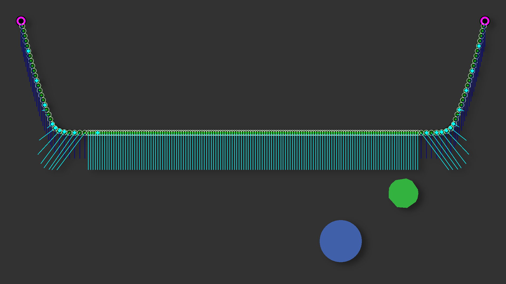 | **Debug Render Module** | Visualizing tension, collision width, forces, and velocities |
| 12 | 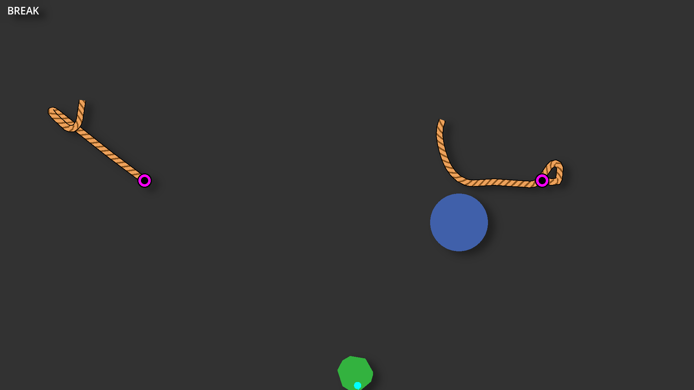 | **Break Module** | CRopeTensionBreakMod — rope breaking under tension |
| 13 | 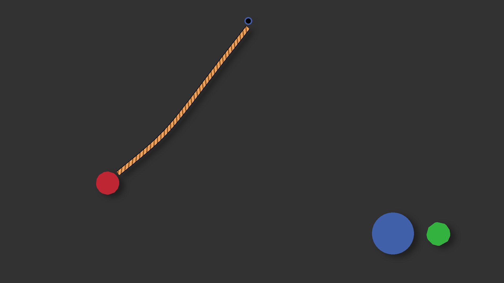 | **Simple Pendulum** | Rope anchored between an obstacle and a physics boulder |
| 14 |  | **Playground** | Sandbox scene with multiple ropes, obstacles, and breakable segments |
| 15 | 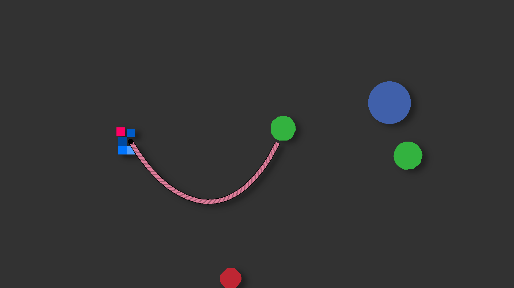 | **Grappling Hook** | Interactive hook — shoot, retract, and cut rope dynamically |
| 16 | 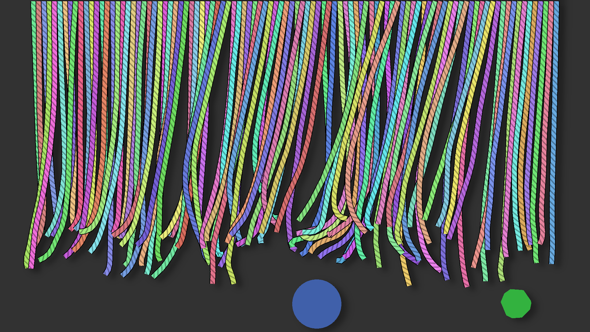 | **Stress Test** | N ropes hanging from the ceiling — configurable count, length, and colors |
| 17 | 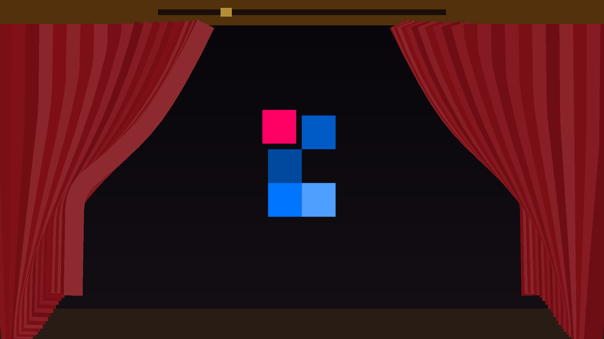 | **Grand Curtain** | A theater curtain of dense rope strands parting to reveal the logo |

### A Note on Scale

The example scenes are deliberately built outside realistic physical proportions — ropes are extremely long (often 10–16 meters) and wide (15–20 cm). This was an intentional choice: exaggerated scale simply looks better in a presentation context and makes the physics behavior easier to observe.

However, it also means the examples feel a bit like slow motion. The gravitational acceleration is a standard 980 px/s², but when a rope is 16 meters long, it naturally takes more time to swing — the physics are correct, the proportions are not.

For a real game, pay attention to proper rope lengths and widths. Press F2 in any example to see the scale bar and get a sense of the actual dimensions involved.

### Scene Notes

Observations, tips, and things to try in each example scene.

<details><summary><strong>e01 — Jellyfish</strong></summary>

The opener scene. Bioluminescent jellyfish drift through dark water. Each pulse squashes the bell, fires a thrust kick and sends a wave of light down the rope tentacles. Below, a meadow of seagrass blades sways in the current, lit by shimmering light shafts. Drag the jellyfish or the seagrass around.
</details>

<details><summary><strong>e02 — Plug the Wires</strong></summary>

A mini-game: four colored cables hang from the breaker panel, and each plug must be dragged into the socket of the matching color scattered around the screen. A correctly seated plug starts an animated current pulse running down the wire — a shader driven by the rope mesh UVs, which run along the rope's length. Power all four and the bulb lights up. ENTER resets.
</details>

<details><summary><strong>e03 — Kite</strong></summary>

A little guy flying a kite in gusty wind. He walks (A/D), jumps (SPACE) and winds the line in and out (W/S) while his physical arm follows every tug of the line. The line collides with the grass and the scene frame, ten ribbon tails of random lengths flutter from the kite's tip, and the wind pushes the kite toward the upper right through lulls and gusts. Drag the guy around — or grab the kite itself.
</details>

<details><summary><strong>e04 — Growing Sunflowers</strong></summary>

Sunflower stems that grow at runtime: every fraction of a second a new point is appended to each stem via `CRopeData.append()`, and the constraint solver immediately weaves it into the simulation. The stem keeps its own upward vigor while a custom force module pulls the flower (the rope tip) toward the draggable sun and weighs it down, so the stem stays upright and bears the head while the bloom leans to the light. Each head turns to face the sun, showing its green back once the sun dips below it. Leaves unfurl along the stem, burdock leaves spread at the base, and the sky shifts from day to dusk with the sun's height. Press SPACE to replant the garden.
</details>

<details><summary><strong>e05 — Firefly Meadow</strong></summary>

A night meadow full of fireflies, each tethered to a grass root by a barely visible thread rope. They buzz on their tethers and blink softly. Drag one far away and release it to watch the thread snap it back.
</details>

<details><summary><strong>e06 — Gravity Force Module</strong></summary>

Notice that the rope without gravity still handles collisions correctly — no parasitic forces appear when the rope rests against obstacles. This is a common problem in collision systems built on top of Verlet integration, where resting contact tends to introduce spurious energy into the system.
</details>

<details><summary><strong>e07 — Magnet Force Module</strong></summary>

This scene uses two force modules at the same time — gravity and magnet. Try disabling the gravity module in the Godot editor and then play with the magnet in zero gravity to see the magnet's effect in isolation.
</details>

<details><summary><strong>e08 — Simplify Line Module</strong></summary>

A well-designed rope that needs proper environment collisions should have its `collision_width` equal to `data.segment_length`. This means the imaginary circles around each point just touch when the rope is relaxed — giving the best collision coverage. But in many situations (e.g. a rope simply hanging from the ceiling), rendering all those simulation points is wasteful. The simplify module reduces the number of points used to build the rendered line mesh, without affecting the underlying Verlet simulation or collision resolution.
</details>

<details><summary><strong>e09 — Subdivide Line Module</strong></summary>

This scene shows a rope with an extremely low point count. The computational cost becomes nearly negligible, making it ideal for decorative elements in a game. However, a rope with this few points is not suitable for environment collisions, since collisions are only resolved around actual rope points. To prevent such a rope from looking like a series of straight line segments, the subdivide module smooths it visually at almost no cost, hiding the fact that the underlying simulation uses very few points.
</details>

<details><summary><strong>e10 — Custom Render Modules</strong></summary>

A deliberately over-the-top scene that exists purely to demonstrate the rope's modularity. The render modules here are implemented in GDScript, showing that custom modules don't need to be written in C++. The visual result is nonsensical — it's about the possibilities, not the aesthetics.
</details>

<details><summary><strong>e11 — Debug Render Module</strong></summary>

The debug renderer draws diagnostic overlays behind the rope — tension, collision width, forces, velocities. Individual debug elements can be toggled on and off independently, so you can focus on exactly what you need to inspect.
</details>

<details><summary><strong>e12 — Break Module</strong></summary>

Demonstrates rope breaking under tension. When the tension exceeds a configured threshold, the rope snaps at its most stressed point. In this example, once a rope is broken it cannot break again — a broken piece no longer has anchors on both sides, so tension cannot build up. This behavior is configurable on the break module itself, allowing for different setups like chain-breaking or single-snap ropes.
</details>

<details><summary><strong>e13 — Simple Pendulum</strong></summary>

Two independent systems work together here. First, the rope's own collision and constraint forces — these keep the rope's shape and handle interaction with the environment. Second, the anchor pull force — this is what acts on the rigid body attached to the rope's end.

Getting good results requires tuning these two systems against each other. If the anchor pull is too weak relative to the rope's internal forces, the rigid body lags behind; too strong and it overshoots.

Importantly, the rigid body is genuinely connected to the rope through the anchor — there is no hidden trick behind the scenes. Many Verlet rope implementations cheat by creating a hidden physics joint (like the ones built into the physics engine) between the rigid body and the far end of the rope, which secretly maintains distance and prevents the Verlet simulation from falling apart. CRope2D does not do this — the connection is real and handled entirely within the rope's own physics.
</details>

<details><summary><strong>e14 — Playground</strong></summary>

A sandbox scene with a long rope and several obstacles. Drag the boulder around and try wrapping the rope between obstacles to see how it behaves under complex entanglement.
</details>

<details><summary><strong>e15 — Grappling Hook</strong></summary>

A more interactive scene. Shoot ropes, cut them, and leave them dangling in the scene. Try pulling between the player and a wall or between the player and a rigid body to see how tension behaves in a dynamic gameplay-like setup.
</details>

<details><summary><strong>e16 — Stress Test</strong></summary>

A pure performance benchmark — find out how many ropes your hardware can handle at 60 FPS. Note that ropes simply hanging are significantly cheaper on the CPU than ropes actively colliding with obstacles.
</details>

<details><summary><strong>e17 — Grand Curtain</strong></summary>

A theater curtain made of 46 dense velvet rope strands hanging from the proscenium. SPACE draws the curtain: the strand roots slide aside in a wave from the center, the strands swing with momentum, and the Cuberact logo is revealed in the spotlight. Made for the final shot of a showcase video.
</details>

### Custom Modules

**Not meant for real use.** These GDScript modules exist solely to showcase the module API — how to subclass base module types and hook into the rope pipeline from GDScript. Some of them are deliberately absurd or impractical. For actual projects, the built-in C++ modules cover the vast majority of use cases. Treat these as API reference material, not as something to drop into your game. Source code in `cuberact-library-examples/CRope2D/scripts/custom_modules/`.

| Module | Base class | Description |
|--------|------------|-------------|
| `AntigravityForceModule` | CRopeForceMod | Pushes rope upward, counteracting gravity |
| `NoiseForceModule` | CRopeForceMod | Applies sine/cosine-based random forces (turbulence) |
| `DecimateLineModule` | CRopeLineMod | Keeps only every Nth point, reducing point count |
| `WaveLineModule` | CRopeLineMod | Adds animated sine wave offset for a wavy effect |
| `CircleRenderModule` | CRopeRenderMod | Draws circles at each rope point |
| `GlowRenderModule` | CRopeRenderMod | Creates a glow by drawing multiple layers with decreasing opacity |
| `ParticleRenderModule` | CRopeRenderMod | Emits GPUParticles2D along the rope |
| `TensionColorRenderModule` | CRopeRenderMod | Colors the rope based on per-segment tension |
| `TrailRenderModule` | CRopeRenderMod | Draws a fading ghost trail (afterimage effect) |
| `SimpleBreakModule` | CRopeBreakMod | Breaks rope at the most stressed point |

---

## Controls

All example scenes include a `DevTools` node providing camera and interaction controls:

| Input | Action |
|-------|--------|
| LMB | Drag physics bodies (or anchors where configured) |
| RMB | Drag physics bodies (or anchors where configured) |
| MMB drag | Pan camera |
| MMB click | Toggle boulder gravity |
| Mouse wheel | Zoom camera |
| R | Reset camera |
| V | Toggle VSync |
| F1 | Show/hide controls overlay |
| F2 | Show/hide FPS and debug probe |
| F12 | Show/hide hint |
| ESC | Back to launcher |

## Project Structure

```
├── addons/                                   Library binaries (keep in your project)
│   └── cuberact-library/
├── cuberact-library-examples/                Examples (delete when done exploring)
│   ├── CRope2D/                              17 example scenes
│   │   └── scripts/                          GDScript helpers and custom modules
│   ├── commons/                              Shared scenes, scripts, and shaders
│   └── examples-launcher.tscn/.gd            Example scene picker
├── project.godot                             Development project (not distributed)
└── CROPE2D.md                                API reference
```

## Support

[](https://ko-fi.com/cuberact)

- **News and updates:** [X / Twitter](https://x.com/cuberact)
- **Bug reports and feature requests:** [GitHub Issues](https://github.com/cuberact/godot-cuberact-library/issues)
- **Questions and discussion:** Comments on the [itch.io page](https://cuberact.itch.io/cuberact-library)
- **Devlogs and demos:** [YouTube](https://www.youtube.com/@Cuberact)

## License

Free for learning, prototyping, and game jams. A paid license is required when you publish a game. See [LICENSE.md](addons/cuberact-library/LICENSE.md) for full terms.
